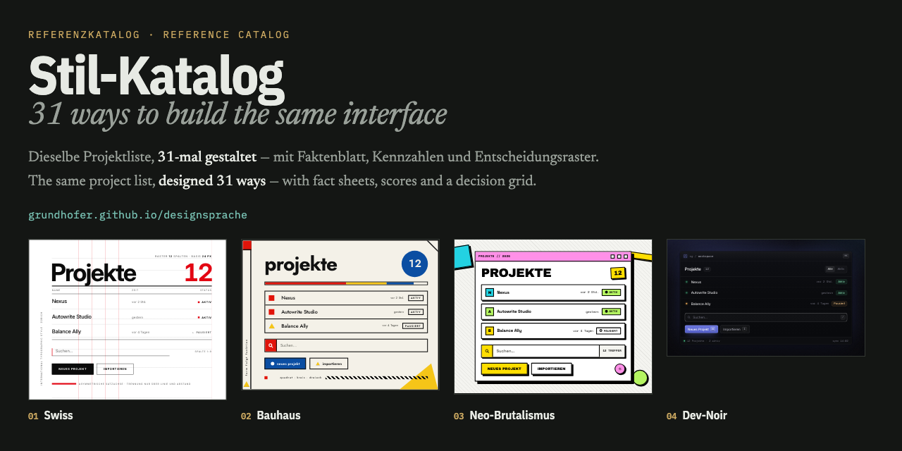

# Stil-Katalog

**31 UI-Stilrichtungen — jede als gerendertes Beispiel derselben Oberfläche.**
31 UI style directions — each rendered as the very same interface.

→ **[grundhofer.github.io/designsprache](https://grundhofer.github.io/designsprache)**
&nbsp;·&nbsp; [Deutsch](https://grundhofer.github.io/designsprache/de/)
&nbsp;·&nbsp; [English](https://grundhofer.github.io/designsprache/en/)



---

## Deutsch

Über UI-Stile wird meist in Adjektiven geredet. „Clean", „modern", „verspielt" — Wörter, unter
denen sich jeder etwas anderes vorstellt. Dieser Katalog ersetzt sie durch Anschauung.

Jeder der 31 Einträge zeigt **exakt dieselbe Oberfläche**: eine Projektliste mit Kopfzeile, drei
Einträgen, einem Suchfeld und zwei Schaltflächen — dieselben dreizehn Textbausteine, überall.
Das Einzige, was sich ändert, ist die Gestaltung. Dadurch wird vergleichbar, was ein Stil
tatsächlich entscheidet, und was nur Geschmack ist.

Zu jedem Stil gehört ein Faktenblatt: Herkunft und Entstehungskontext, sechs bis neun harte
visuelle Merkmale mit konkreten Werten, echte Vertreter mit belegten Farbwerten und Radien,
Stärken, Risiken, Barrierefreiheits-Konsequenzen, Alterungsverhalten, Plattform-Eignung und
ein Praxistipp.

### Die sieben Parameter

Stilnamen sind austauschbar. Was einen Stil ausmacht, sind sieben Größen — und jede davon ist
eine Entscheidung, die man als Design-Token schreiben kann:

| Parameter | Spanne | Wirkung |
|---|---|---|
| **Radius** | 0 px → vollrund | Der am stärksten unterschätzte Markenträger |
| **Kontrast** | 1,5:1 → 18:1 | Ob eine Oberfläche ruhig oder laut wirkt |
| **Tiefe** | keine → Linie → Schatten → Unschärfe → z-Achse | Wie Hierarchie entsteht |
| **Dichte** | Faktor 5 zwischen den Extremen | Information pro Bildschirm |
| **Farbe** | monochrom+Akzent → Flächenfarbe → Verlauf | Wie viel Bedeutung Farbe trägt |
| **Typografie** | Grotesk / Serif / Mono / Display | Zweitstärkster Wiedererkennungsträger |
| **Motion** | 0 ms → 120 ms linear → 400 ms Spring | Die Persönlichkeit — meist vergessen |

Wer diese sieben kennt, kann Stile **mischen statt kopieren**. Kein starkes Produkt trägt einen
Reinstil: Linear ist Swiss-Raster plus Dark-Mode plus Terminal-Dichte, Notion ist Warm Editorial
plus Flat, Stripe ist Swiss plus Aurora.

### Die neun Familien

**Modernistische Schulen** — Swiss · Bauhaus · De Stijl
**Postmoderne & Rebellion** — Memphis · Swiss Punk · Web-Brutalismus
**Digitale Epochen** — Skeuomorphismus · Flat · Material 3 Expressive
**Weiche Materialität** — Neumorphismus · Glassmorphism · Claymorphism
**Produkt-Ästhetik heute** — Dev-Noir · Warm Editorial · Neo-Brutalismus · Terminal-Mono · Data-Dense · Spatial
**Norm & Beschränkung** — Civic/GOV.UK · E-Paper
**Nostalgie & Subkultur** — Y2K/Frutiger Aero · Vaporwave · Retro-Futurismus
**Ausdruck & Geste** — Organic/Blob · Maximalismus · Aurora-Mesh · Hand-Drawn
**Weitere Pole** — Editorial-Print · Pixel/8-Bit · Playful-Chunky · Portal-Dichte

„Norm & Beschränkung" ist die jüngste Familie und die einzige, die keine Geschmacksfrage
versammelt: Stile, deren Werte nachweislich nicht der Gestalter gesetzt hat, sondern eine
Prüfvorschrift, eine Darstellungsnorm oder die Physik des Displays. Das Aufnahmekriterium ist
prüfbar — *man kann benennen, wer den Wert gesetzt hat, und es war nicht der Gestalter.*
Sie beantwortet die Leitfrage des Katalogs von der anderen Seite: hier war nichts Geschmack.

"Norm & Constraint" is the newest family and the only one that does not collect a matter of
taste: styles whose values were demonstrably not set by a designer but by a compliance standard,
a display convention, or the physics of a screen. The admission test is checkable — *you can name
who set the value, and it was not the designer.*

---

## English

Talk about UI styles usually happens in adjectives. "Clean", "modern", "playful" — words that
mean something different to everyone. This catalog replaces them with evidence.

Each of the 31 entries shows **exactly the same interface**: a project list with a header, three
rows, a search field and two buttons — the same thirteen pieces of text throughout. The only
thing that changes is the design. That makes it comparable what a style actually decides, and
what is merely taste.

Every style comes with a fact sheet: origin and context, six to nine hard visual markers with
concrete values, real-world examples with sourced color values and radii, strengths, risks,
accessibility consequences, how it ages, platform fit, and one practical tip.

The seven parameters that constitute any style — radius, contrast, depth, density, color,
typography, motion — are each a decision you can write down as a design token. Know them, and
you can mix styles instead of copying them.

---

## Aufbau / How it works

Kein Framework, kein Build-Tool-Zoo. Ein Python-Skript ohne Abhängigkeiten baut aus den
Quelldateien drei statische Seiten.

No framework, no build-tool zoo. One dependency-free Python script turns the sources into three
static pages.

```
styles/
  swiss.html        Demo: ein <style>-Element + ein <div class="style-swiss">
  swiss.json        Faktenblatt / fact sheet
  swiss.en.html     englische Fassung, CSS zeichengleich / English, byte-identical CSS
  swiss.en.json
  … 31 Stile × 4 Dateien
landing.html        zweisprachige Eingangsseite / bilingual entry page
build.py            Generator
docs/               erzeugt / generated — nicht eingecheckt / not committed
```

```sh
python3 build.py              # docs/index.html, docs/de/, docs/en/
python3 build.py --artifact   # zusätzlich ein Fragment ohne <head>
python3 build.py --og         # og.html, die Vorlage des Vorschaubilds
```

`og.png` liegt im Repository statt im Build, weil der CI-Runner keinen Browser hat. Neu
rendern nach einer Änderung an `og.html`:

`og.png` is committed rather than built, because the CI runner has no browser. Re-render it
after changing `og.html`:

```sh
python3 build.py --og
"/Applications/Google Chrome.app/Contents/MacOS/Google Chrome" \
  --headless --disable-gpu --hide-scrollbars --force-device-scale-factor=1 \
  --virtual-time-budget=9000 --screenshot=og.png --window-size=1280,640 \
  "file://$PWD/og.html"
```

### Die Scoping-Regel

31 Stylesheets teilen sich eine Seite. Damit sie sich nicht gegenseitig zerstören, gilt für
jede Demo: **jeder CSS-Selektor beginnt mit `.style-<slug>`**, `@keyframes`-Namen sind mit
`<slug>-` präfigiert, und es gibt kein `:root`, kein `body`, keinen nackten Element-Selektor.
`build.py` prüft das bei jedem Lauf und bricht bei Verstoß ab.

31 stylesheets share one page. So they cannot destroy each other, every demo obeys one rule:
**every CSS selector starts with `.style-<slug>`**, `@keyframes` names are prefixed with
`<slug>-`, and there is no `:root`, no `body`, no bare element selector. `build.py` verifies
this on every run and fails the build on violation.

Die Demos sind handgebautes HTML und CSS — keine Bilder, keine Skripte, keine Bibliotheken.
Grafik entsteht aus Gradients, `box-shadow`, Borders, Inline-SVG und CSS-Mustern. Schriften
kommen von Google Fonts.

---

## Warum „Designsprache" / Why "Designsprache"

Das Repository heißt nicht „Stil-Katalog", weil der Katalog nur der erste Teil ist.
*Designsprache* ist das deutsche Wort für die visuelle und interaktive Sprache einer Marke —
Farbe, Typografie, Radius, Abstand, Motion, Tonfall und die Regeln, nach denen sie
zusammenwirken.

Der Katalog beantwortet die Frage **„welche Sprachen gibt es und was entscheidet jede?"**
Die Antwort auf **„welche wird meine?"** kommt später in dasselbe Repository: Design-Tokens
im DTCG-Format, aus einer Quelle nach CSS, Tailwind, Jetpack Compose und SwiftUI generiert,
dazu die Komponenten darauf. Der Katalog ist die Entscheidungsgrundlage dafür, kein Selbstzweck.

Bis dahin steht hier ausschließlich der Katalog. Das ist kein Platzhalter — er funktioniert
für sich, und wer nur ihn braucht, braucht den Rest nicht.

The repository is not called "style catalog" because the catalog is only the first part.
*Designsprache* is the German word for the visual and interactive language of a brand — color,
typography, radius, spacing, motion, tone of voice, and the rules by which they work together.

The catalog answers **"which languages exist, and what does each of them decide?"** The answer
to **"which one becomes mine?"** will land in this same repository later: design tokens in DTCG
format, generated from one source into CSS, Tailwind, Jetpack Compose and SwiftUI, plus the
components built on them. The catalog is the basis for that decision, not an end in itself.

Until then this repository holds the catalog and nothing else. That is not a placeholder — it
stands on its own, and anyone who only needs the catalog does not need the rest.

---

## Mitmachen / Contributing

Ein 28. Stil ist willkommen — siehe **[CONTRIBUTING.md](CONTRIBUTING.md)**.
Korrekturen an Jahreszahlen, Urhebern, Farbwerten oder Einschätzungen ebenso: die
Faktenblätter sind recherchiert, aber nicht unfehlbar.

A 28th style is welcome — see **[CONTRIBUTING.md](CONTRIBUTING.md)**. Corrections to dates,
attributions, color values or judgements are equally welcome: the fact sheets are researched
but not infallible.

---

## Lizenz / License

- **Code** (`build.py`, `landing.html`, die Demos in `styles/*.html`) — [MIT](LICENSE).
  Nimm eine Demo, bau sie um, verwende sie kommerziell.
- **Texte** (die Faktenblätter in `styles/*.json`, die Prosa der Seite) —
  [CC BY 4.0](LICENSE-CONTENT.md). Weiterverwendung mit Namensnennung.

Die vier Kennzahlen je Stil (Haltbarkeit, Wiedererkennung, Aufwand, Dichte) sind fachliche
Einschätzungen, keine Messwerte. Genannte Produkt- und Markennamen gehören ihren jeweiligen
Inhabern; die Demos sind eigenständige Nachbauten im jeweiligen Stil, keine Kopien.

The four scores per style are professional judgements, not measurements. Product and brand
names belong to their respective owners; the demos are original recreations in the respective
style, not copies.

© Sebastian Grundhöfer
